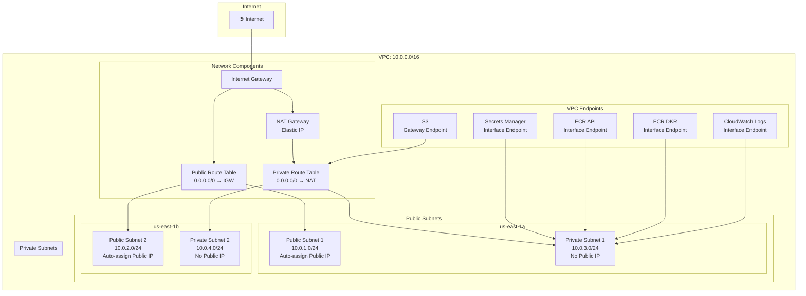
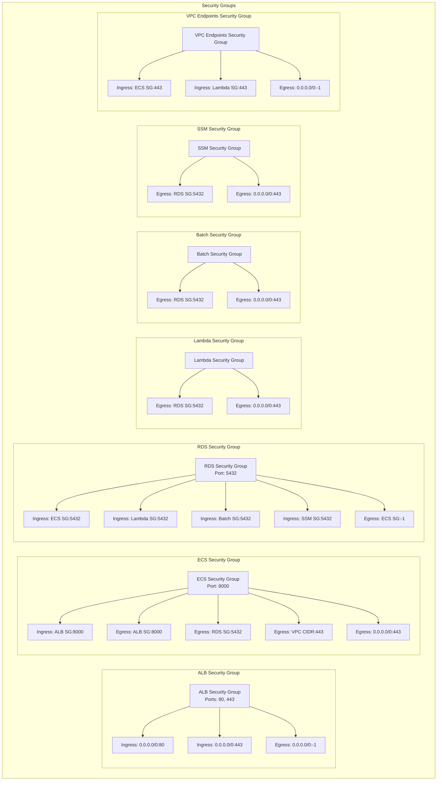
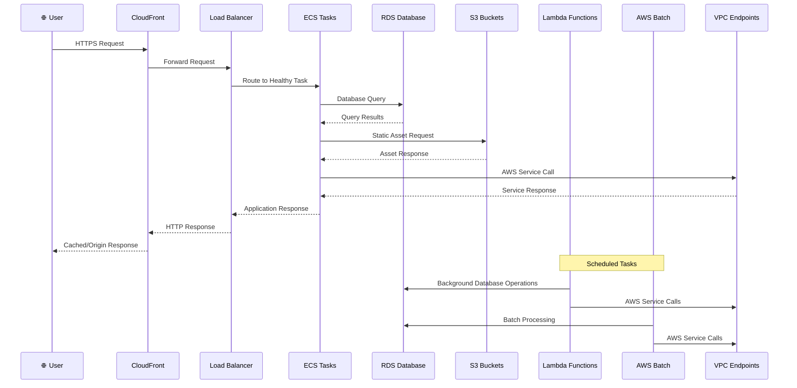
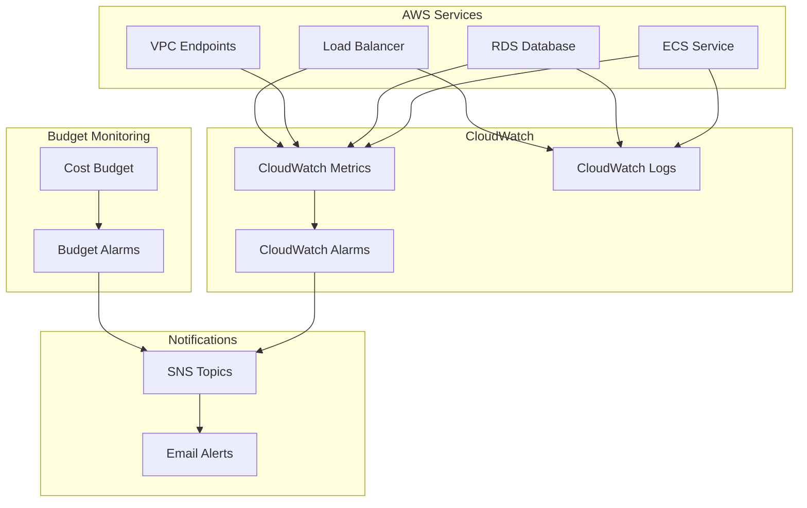
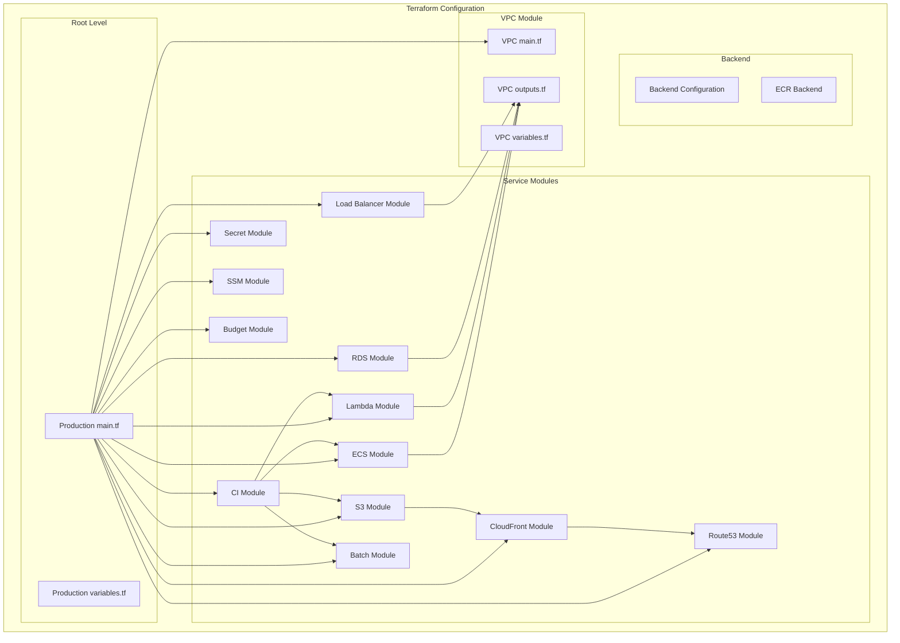

# AWS Infrastructure Architecture Diagram

This document contains Mermaid diagrams that visualize the complete AWS infrastructure architecture.

## 🏗️ High-Level Architecture

```mermaid
graph TB
    subgraph "Internet"
        Users[🌐 Users]
    end
    
    subgraph "AWS Cloud"
        subgraph "Edge Services"
            CF[CloudFront<br/>CDN Distribution]
            ACM[ACM Certificates<br/>SSL/TLS]
        end
        
        subgraph "Public Layer"
            ALB[Application Load Balancer<br/>HTTPS:443, HTTP:80]
            ALB_SG[ALB Security Group]
            IGW[Internet Gateway]
            NAT[NAT Gateway<br/>Elastic IP]
        end
        
        subgraph "Private Layer"
            subgraph "ECS Cluster"
                ECS[ECS Fargate Tasks<br/>Port 8000]
                ECS_SG[ECS Security Group]
            end
            
            subgraph "Database Layer"
                RDS[RDS PostgreSQL<br/>Port 5432]
                RDS_SG[RDS Security Group]
            end
            
            subgraph "Serverless"
                LAMBDA[Lambda Functions<br/>Scheduled Tasks]
                LAMBDA_SG[Lambda Security Group]
                BATCH[AWS Batch Jobs<br/>Background Processing]
                BATCH_SG[Batch Security Group]
            end
            
            subgraph "Management"
                SSM[SSM Instance<br/>Bastion Host]
                SSM_SG[SSM Security Group]
            end
        end
        
        subgraph "Storage & Services"
            S3_STATIC[S3 Static Content<br/>Website Assets]
            S3_LOGS[S3 ALB Logs<br/>7-day Retention]
            SECRETS[Secrets Manager<br/>App & DB Credentials]
        end
        
        subgraph "VPC Endpoints"
            VPCE_SM[VPC Endpoint<br/>Secrets Manager]
            VPCE_S3[VPC Endpoint<br/>S3 Gateway]
            VPCE_ECR[VPC Endpoint<br/>ECR API/DKR]
            VPCE_LOGS[VPC Endpoint<br/>CloudWatch Logs]
        end
        
        subgraph "Monitoring"
            CW_LOGS[CloudWatch Logs]
            CW_ALARMS[CloudWatch Alarms]
            SNS[SNS Topics<br/>Alert Notifications]
        end
        
        subgraph "CI/CD"
            GITHUB[GitHub Actions<br/>OIDC Provider]
            CI_ROLE[CI IAM Role<br/>Deployment Permissions]
        end
    end
    
    subgraph "DNS & Routing"
        R53[Route53<br/>livedisplaced.com]
        ECR[ECR Repository<br/>Container Images]
    end
    
    %% User traffic flow
    Users --> CF
    CDN --> CF
    CF --> ALB
    ALB --> ECS
    
    %% Internal traffic flows
    ECS --> RDS
    ECS --> S3_STATIC
    ECS --> SECRETS
    ECS --> VPCE_SM
    ECS --> VPCE_S3
    ECS --> VPCE_ECR
    ECS --> VPCE_LOGS
    
    LAMBDA --> RDS
    LAMBDA --> SECRETS
    LAMBDA --> VPCE_SM
    
    BATCH --> RDS
    BATCH --> SECRETS
    BATCH --> VPCE_SM
    
    SSM --> RDS
    
    %% Network flow
    IGW --> ALB
    IGW --> NAT
    NAT --> ECS
    NAT --> LAMBDA
    NAT --> BATCH
    NAT --> SSM
    
    %% Monitoring flow
    ECS --> CW_LOGS
    LAMBDA --> CW_LOGS
    BATCH --> CW_LOGS
    CW_LOGS --> CW_ALARMS
    CW_ALARMS --> SNS
    
    %% CI/CD flow
    GITHUB --> CI_ROLE
    CI_ROLE --> ECS
    CI_ROLE --> LAMBDA
    CI_ROLE --> BATCH
    CI_ROLE --> S3_STATIC
    
    %% DNS flow
    R53 --> CF
    R53 --> ALB
    R53 --> ACM
    
    %% Storage flow
    ALB --> S3_LOGS
    ECR --> ECS
    ECR --> LAMBDA
    ECR --> BATCH
```

## 🌐 Network Architecture

## 🔐 Security Architecture

## 🔄 Data Flow Architecture

## 📊 Monitoring & Alerting Architecture

## 🔧 Infrastructure as Code Structure

---

## 📋 Diagram Legend

- **🟢 Green**: Public/Internet-facing resources
- **🔴 Red**: Private/internal resources  
- **🔵 Blue**: Security and networking components
- **🟡 Yellow**: Storage and data services
- **🟠 Orange**: Compute and application services
- **🟣 Purple**: Monitoring and management services

## 🔍 How to Use These Diagrams

1. **High-Level Architecture**: Use for stakeholder presentations and overview
2. **Network Architecture**: Use for network design reviews and troubleshooting
3. **Security Architecture**: Use for security audits and compliance reviews
4. **Data Flow**: Use for understanding application behavior and performance
5. **CI/CD Pipeline**: Use for deployment process documentation
6. **Monitoring**: Use for observability and alerting setup
7. **Infrastructure as Code**: Use for development and maintenance planning

These diagrams are automatically generated from the Terraform configuration and provide a comprehensive view of your AWS infrastructure architecture.
